# Hoverchart Architecture

A comprehensive Mermaid diagram documenting all components, hooks, stores, services, utilities, and web workers in the Hoverchart 3D diagram tool.

---

## Application Entry

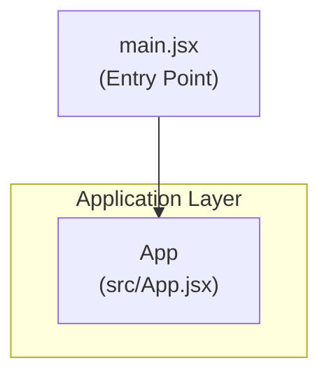

---

## Component Tree

```mermaid
flowchart TD
    App --> Canvas["Canvas\n(@react-three/fiber)"]
    App --> EffectComposer["EffectComposer\n(@react-three/postprocessing)"]
    App --> CustomCamera
    App --> UIOverlay
    App --> ObjectsRenderer
    App --> ConnectionsRenderer
    App --> RealTimeConnectionUpdater
    App --> CellBoundaryRenderer
    App --> FrameTicker
    App --> FrameloopController
    App --> LODManager
    App --> DiagramOverlay2D

    subgraph ObjectComponents["3D Object Components"]
        ObjectsRenderer --> Cube
        ObjectsRenderer --> Dodecahedron
        ObjectsRenderer --> Tetrahedron
        ObjectsRenderer --> Plane
        ObjectsRenderer --> TextObject
        ObjectsRenderer --> ModelObject
    end

    subgraph UIComponents["UI Components"]
        Cube --> ObjectUI
        Cube --> FaceUI
        Cube --> HeaderInput
        Cube --> FaceTextInput
        Cube --> TransformControls
        Dodecahedron --> HeaderInput
        Dodecahedron --> FaceTextInput
        Tetrahedron --> HeaderInput
        Tetrahedron --> FaceTextInput
        Plane --> HeaderInput
        Plane --> FaceTextInput
        TextObject --> TextObjectUI
        TextObject --> TextStyleUIContainer
        UIOverlay --> ColorPicker
        ConnectionsRenderer --> LineUI
        ConnectionsRenderer --> HeaderInput
    end

    subgraph VisualComponents["Visual / Feedback Components"]
        Cube --> FaceIndicator
        Cube --> TextSprite
        Cube --> SnapIndicator
        Cube --> SnapLineIndicator
        Cube --> ResizeArrows
        Dodecahedron --> FaceIndicator
        Tetrahedron --> FaceIndicator
        Plane --> FaceIndicator
        TextObject --> FaceIndicator
        ConnectionsRenderer --> AnimatedConnectionLine
        ConnectionsRenderer --> PooledLine
        UIOverlay --> ResizeArrow2D
        UIOverlay --> WhitePlane
    end
```

---

## Custom Hooks

```mermaid
flowchart TD
    subgraph Hooks["src/hooks/"]
        useAuthState["useAuthState\n- user, isAuthReady, isCheckingUrlAuth"]
        useAuth["useAuth\n- authState"]
        useSpaceManager["useSpaceManager\n- currentSpaceId"]
        useObjects["useObjects\n- selectedId, handleCreateObject, handleObjectDelete"]
        useConnections["useConnections\n- connections, addConnection, removeConnection"]
        useIndicators["useIndicators\n- showAllCubesIndicators, isConnectMode"]
        useSpatialManager["useSpatialManager\n- loadedCells, currentCellCoords"]
        useCentralizedBroadcastManager["useCentralizedBroadcastManager\n- lifecycle cleanup"]
        useTimeoutManager["useTimeoutManager\n- setNamedTimeout, clearNamedTimeout"]
        useLinePool["useLinePool\n- pooled geometry & material"]
        useFrustumCulling["useFrustumCulling\n- visible connections set"]
        useLOD["useLOD\n- LOD level per object"]
        useTextureUpdater["useTextureUpdater\n- canvas texture updates"]
        useDebouncedUpdate["useDebouncedUpdate\n- debounced state flush"]
        useGlobalClickHandler["useGlobalClickHandler\n- global pointer events"]
        useAnimationStats["useAnimationStats\n- frame timing"]
        useDynamicFrustumCulling["useDynamicFrustumCulling\n- adaptive culling"]
        useFrustumCulledConnections["useFrustumCulledConnections\n- culled connection list"]
        useConnectionState["useConnectionState\n- connection read slice"]
        useConnectionActions["useConnectionActions\n- connection write slice"]
    end

    App --> useAuthState
    App --> useAuth
    App --> useSpaceManager
    App --> useObjects
    App --> useConnections
    App --> useIndicators
    App --> useSpatialManager
    App --> useCentralizedBroadcastManager
    App --> useTimeoutManager
    ConnectionsRenderer --> useLinePool
    ConnectionsRenderer --> useFrustumCulling
    ConnectionsRenderer --> useFrustumCulledConnections
    ObjectsRenderer --> useLOD
```

---

## Zustand Stores

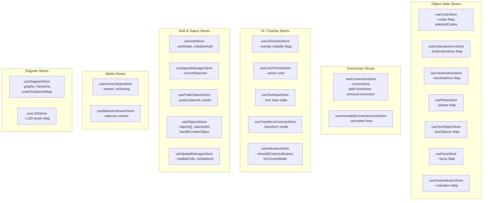

---

## Services

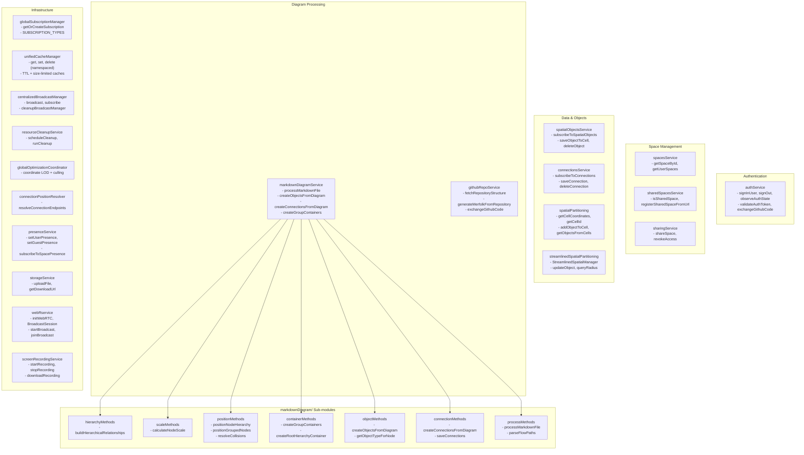

---

## Web Workers

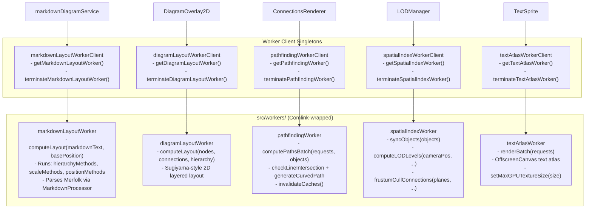

---

## Utilities

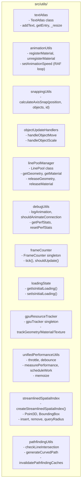

---

## Data Flow: Core Pipeline

```mermaid
flowchart LR
    A["GitHub OAuth\nauthService.exchangeGithubCode()"] --> B["Repo Scan\ngithubRepoService.fetchRepositoryStructure()"]
    B --> C["AST Analysis\ngenerateMerfolkFromRepository()\n@babel/parser"]
    C --> D["Merfolk Markdown\n```merfolk block```"]
    D --> E["markdownLayoutWorker\nMarkdownProcessor AST\nbuildHierarchicalRelationships()"]
    E --> F["Layout\npositionNodeHierarchy()\npositionGroupedNodes()\nresolveCollisions()"]
    F --> G["3D Objects\ncreateObjectsFromDiagram()\nZustand + Firebase"]
    G --> H["Containers\ncreateGroupContainers()\ncreateRootHierarchyContainer()"]
    H --> I["Connections\ncreateConnectionsFromDiagram()\nsaveConnections()"]
```

---

## Data Flow: Real-time Object Sync

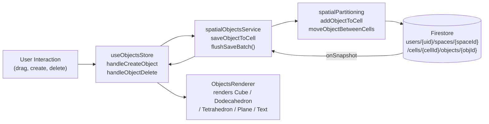

---

## Data Flow: Connection Pipeline

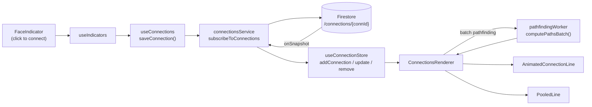

---

## Data Flow: Spatial Partitioning & LOD

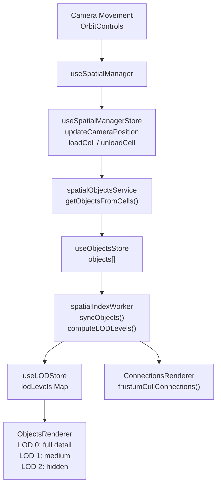

---

## External Dependencies

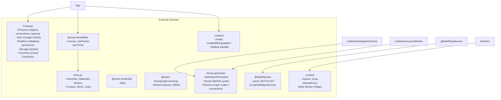

---

## Store ↔ Hook ↔ Service Wiring

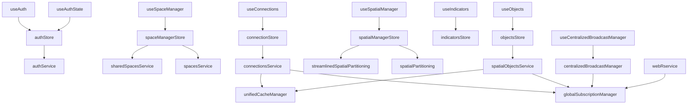
